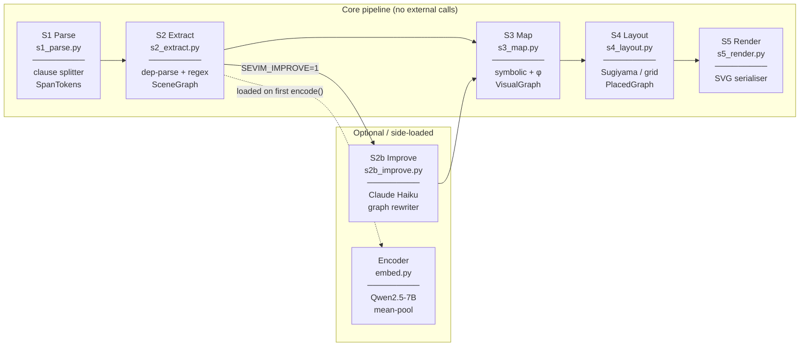

# SeVim — Semantic Visual Mapper

Convert natural-language educational text into deterministic SVG diagrams,
with no hallucination and no external API calls required.

```
"Decision trees partition the feature space recursively."

      ┌──────────────────┐       causes      ┌──────────────────┐
      │  decision tree   │ ────────────────▶ │ feature space    │
      └──────────────────┘                   │ partitioning     │
                                             └──────────────────┘
```

---

## Pipeline overview



| Module | Stage | Input → Output | Key algorithm |
|---|---|---|---|
| `s1_parse.py` | S1 | `str` → `[SpanToken]` | regex clause splitter |
| `s2_extract.py` | S2 | `[SpanToken]` → `SceneGraph` | dep-parse + regex cascade |
| `s2b_improve.py` | S2b *(opt)* | `SceneGraph` → `SceneGraph` | Claude Haiku API |
| `s3_map.py` | S3 | `SceneGraph` → `VisualGraph` | symbolic + frozen-W projection |
| `s4_layout.py` | S4 | `VisualGraph` → `PlacedGraph` | Sugiyama layered layout |
| `s5_render.py` | S5 | `PlacedGraph` → `str` (SVG) | SVG serialisation |
| `embed.py` | — | `str` → `tuple[float,…]` | Qwen2.5-7B mean-pool |
| `ir.py` | — | data model | dataclasses |
| `overlap.py` | S4.5 | `PlacedGraph` → findings | geometry checker |
| `pipeline.py` | — | orchestrator | `run_pipeline()` |
| `cli.py` | — | CLI entry point | argparse |

---

## Installation

**Requires Python 3.10+.**

```bash
# 1. Clone
git clone https://github.com/arashkermaniprojects/sevim.git
cd sevim

# 2. Install the base package (no ML dependencies)
pip install -e .

# 3. (Optional) Install the Qwen encoder for richer node geometry
pip install -e ".[embed]"   # adds torch + transformers
```

The base install runs the full pipeline without Qwen (all embeddings are
empty; shapes fall back to salience-only sizing).

---

## Quick start — CLI

```bash
# Write your text to a file
echo "Gradient descent minimises the loss function by updating weights." > input.txt

# Run the pipeline
sevim input.txt

# Outputs:
#   out.svg          — the diagram
#   out.ir.json      — scene graph (nodes, edges, revision counter)
#   out.trace.json   — per-stage diagnostic trace
```

Custom output prefix:

```bash
sevim input.txt --out diagrams/gradient_descent
# → diagrams/gradient_descent.svg
# → diagrams/gradient_descent.ir.json
# → diagrams/gradient_descent.trace.json
```

Read from stdin:

```bash
cat input.txt | sevim -
```

---

## Quick start — Python API

```python
from sevim.pipeline import run_pipeline

result = run_pipeline("Backpropagation computes gradients using the chain rule.")

print(result.svg)           # SVG string
print(result.graph.nodes)   # list[SceneNode]
print(result.graph.edges)   # list[SceneEdge]
print(result.trace)         # list[TraceEvent], one per stage
```

### Multi-turn / streaming

Pass the previous result's graph to extend the diagram across turns:

```python
r1 = run_pipeline("A neural network contains layers.", utterance_id="u0")
r2 = run_pipeline("Each layer applies a linear transform.", utterance_id="u1", graph=r1.graph)
# r2.svg shows both sentences merged into one diagram
```

---

## Environment variables

| Variable | Default | Effect |
|---|---|---|
| `SEVIM_DISABLE_EMBED` | *(unset)* | Set to `1` to skip Qwen entirely (faster, no torch required) |
| `SEVIM_EMBED_MODEL` | `Qwen/Qwen2.5-7B` | HuggingFace model ID for the encoder |
| `SEVIM_EMBED_MAX_TOKENS` | `128` | Token truncation limit for the encoder |
| `SEVIM_IMPROVE` | *(unset)* | Set to `1` to enable Claude Haiku graph rewriting (S2b) |
| `ANTHROPIC_API_KEY` | *(unset)* | Required when `SEVIM_IMPROVE=1` |
| `SEVIM_STRICT_OVERLAPS` | *(unset)* | Set to `1` to raise `OverlapError` instead of logging |
| `SEVIM_STRICT_DET` | *(unset)* | Set to `1` to pin single-threaded CPU ops (reproducibility) |
| `SEVIM_CANVAS_W` | `700` | Canvas width in SVG user units |
| `SEVIM_CANVAS_H` | `440` | Canvas height in SVG user units |

---

## Relation types

The 12 semantic relations used throughout the pipeline:

| Relation | Visual encoding | Typical meaning |
|---|---|---|
| `causes` | directed arrow | A produces / leads to B |
| `used_for` | dashed arrow | A is a tool or technique for B |
| `requires` | hollow-triangle arrow | A needs B as a prerequisite |
| `reduces_to` | filled triangle (funnel) | A simplifies / specialises to B |
| `measures` | dotted line + `=` label | A quantifies B |
| `contains` | container nesting | A holds B as a member |
| `part_of` | container nesting | A is a component of B |
| `instance_of` | dashed arrow (up) | A is an example of B |
| `similar_to` | double parallel line + `≈` | A and B are analogous |
| `opposes` | bar–bar line | A and B are in contrast |
| `attribute_of` | smaller adjacent ellipse | A is a property of B |
| `sequence` | horizontal strip | A comes before B in order |

---

## Shape grammar

| Primitive | When used |
|---|---|
| `rect` | Default concept node |
| `ellipse` | Attribute / property node |
| `diamond` | Numeric parameter (weight, loss, …) |
| `hexagon` | Neural-network architecture (CNN, RNN, …) |
| `parallelogram` | Layer / transform / projection |

---

## Running tests

```bash
pytest tests/
```

---

## Optional: S2b LLM graph improvement

When `SEVIM_IMPROVE=1` and `ANTHROPIC_API_KEY` are set, the pipeline calls
**Claude Haiku** (`claude-haiku-4-5-20251001`) after S2 extraction to:

- Merge near-duplicate nodes
- Remove spurious edges
- Add missing obvious edges
- Clean verbose node labels

This breaks determinism (invariant I1) because the model is stochastic.
The trace log records the pre- and post-improvement graph sizes.

```bash
export SEVIM_IMPROVE=1
export ANTHROPIC_API_KEY=sk-ant-...
sevim input.txt
```

---

## Citation

If you use SeVim in your research, please cite:

```bibtex
@article{kermanikolankeh2026sevim,
  title     = {{SeVim}: Deterministic Semantic-to-Visual Mapping for Educational Diagrams},
  author    = {Kermani Kolankeh, Arash},
  journal   = {IEEE Transactions on Pattern Analysis and Machine Intelligence},
  year      = {2026},
  note      = {Under review},
  url       = {https://github.com/arashkermaniprojects/sevim}
}
```

---

## License

CC BY-NC 4.0 — free for research and non-commercial use with attribution.
License will be updated to MIT upon paper acceptance.
